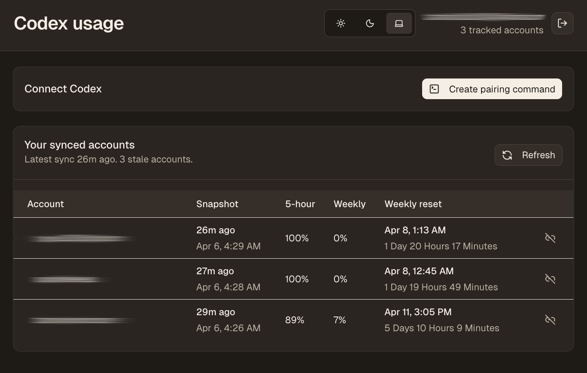

# codex usage

i cycle between multiple codex accounts and wanted to keep track of them so i created this

website: https://codexusage.vercel.app

installation: `npx codex-usage-dashboard@latest connect --site "https://codexusage.vercel.app"`

