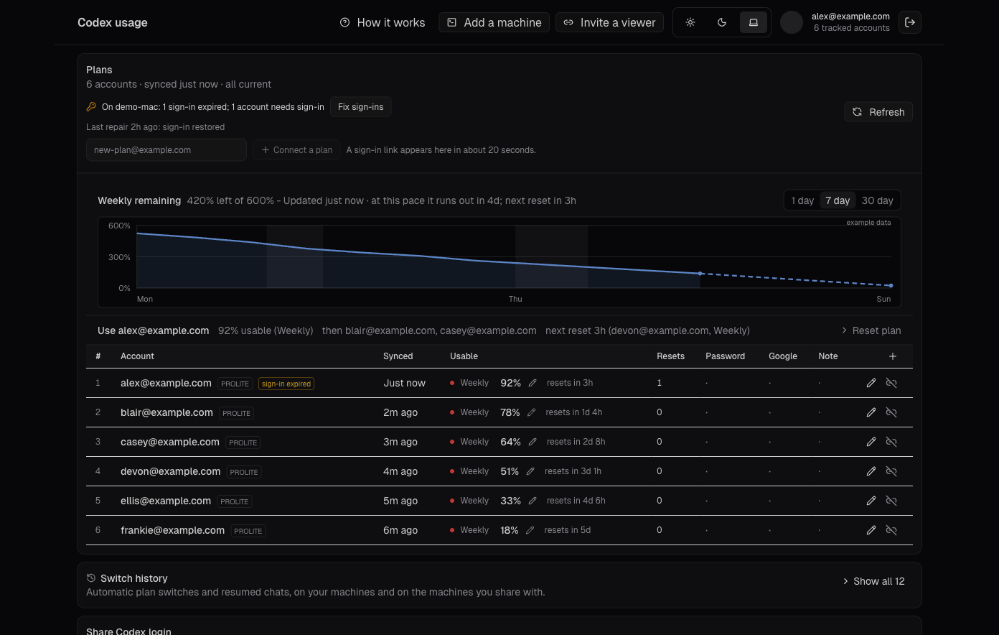

# Codex Usage

Track Codex rate-limit balances and reset times across multiple accounts, then
see which account to use next.

- Dashboard: <https://codexusage.vercel.app>
- npm package: `codex-usage-dashboard`
- Detailed operations guide: [pairing, reset tracking, and releases](./docs/pairing-reset-tracking-and-release-runbook.md)



> The CLI runs with `npx codex-usage-dashboard@latest <command>`, nothing to install. A machine that cannot reach npm can use the pinned GitHub release instead: `npx --yes "github:tario-you/codex-usage#v0.3.0" <command>`.

## What it does

- Collects the rate-limit windows reported by the local Codex CLI.
- Displays the real duration of each available window, including weekly-only
  accounts.
- Plans account order from usable balance and upcoming reset times.
- Projects which reset will make an exhausted account usable again.
- Tracks historical weekly capacity across linked accounts.

## First time here?

Codex usage shows how much of every Codex plan is left, plans which account to
use next, and switches machines to the next plan automatically. There are three
things you can do, and each one has its own command. Pick the one you mean.

| You want to | Do this | What runs on the other machine |
|---|---|---|
| See your own usage in the dashboard | Sign in, choose **Add a machine**, run the command on the machine where you use Codex | `pair` (reports usage only) |
| See every account you own from one machine | Pair once, then `login add` per account and `sync --all --watch` | `login add`, `sync --all` |
| Let a friend use your plans, switching when one runs out | Find **Share Codex login**, choose **Create login command**, send it to them | `use` (signs their Codex into your plan) |
| Let a friend look at your dashboard | Choose **Invite a viewer**, send the link | nothing; they sign in with Google |

The common mistake: sending a friend the **Add a machine** command. That only
adds their usage to your dashboard. It never signs them into your plans. For
that they need the login command from **Share Codex login**.

### 1. See your own usage

1. Open <https://codexusage.vercel.app> and sign in with Google.
2. Choose **Add a machine** in the header. A command appears.
3. Paste the command into Terminal on the machine where you use Codex. It
   looks like this and runs once:

   ```bash
   npx codex-usage-dashboard@latest pair "https://codexusage.vercel.app/api/pair/complete?token=..."
   ```

4. Your plans show up in the dashboard within a minute. For live updates keep
   this running on that machine:

   ```bash
   npx codex-usage-dashboard@latest sync --watch
   ```

The command expires, so create a fresh one when it fails. The CLI keeps its
settings in `~/.codex/codex-usage-sync.json`. No browser account yet? Run
`npx codex-usage-dashboard@latest connect --site "https://codexusage.vercel.app"`
on the machine instead; it links the machine and opens your dashboard.

### 1b. Every account you own, from one machine

Have more than one Codex account? Save each one once, then one command reports
all of them:

```bash
npx codex-usage-dashboard@latest login add
```

That opens the Codex sign-in in your browser; sign in with the account to add,
then run it again for the next account. The logins are kept in
`~/.codex-switcher/accounts.json` (mode 600, the same store the Codex
Switchboard uses). Then:

```bash
npx codex-usage-dashboard@latest sync --all --watch
```

`sync --all` reads every saved account's usage straight from ChatGPT, refreshes
an expired token on the way, includes the account this machine is signed into,
and reports all of them under this machine's pairing. `--watch` repeats every
five minutes (`--every 120` for two). `login list` shows what is saved and
`login remove --email you@example.com` forgets one. The machine still has to
be paired once (section 1) so the dashboard knows whose accounts these are.

### 2. Let a friend use your plans

On your side, once:

1. Add the machine that holds your logins (section 1) and keep
   `sync --watch` running there.
2. Publish your plans from that machine:

   ```bash
   npx codex-usage-dashboard@latest publish-login --all
   ```

3. In the dashboard, find **Share Codex login** and choose
   **Create login command**. Send the command to your friend. It is single
   use and expires after 24 hours.

On their side:

1. Paste the command into Terminal and add `--watch` so it keeps switching:

   ```bash
   npx codex-usage-dashboard@latest use "https://codexusage.vercel.app/api/login/claim?token=..." --watch
   ```

2. Restart the Codex app, or start a new `codex` session. Codex is now on
   your plan.
3. Leave that Terminal window open. When the plan runs out, the watcher moves
   them to your next usable plan and prints `Switched to ...`. Their own login
   is backed up; `npx codex-usage-dashboard@latest use --restore` brings it
   back.

The full owner and recipient details are under [Share a Codex login](#share-a-codex-login).

### 3. Let a friend look

Choose **Invite a viewer**, send the link. They sign in with Google and see
your plans read-only. From there they can also create their own login command
on your plans, and you see and can revoke every command they create.

## Weekly-only Codex limits

Do not assume the first window is always 5-hour and the second window is
always Weekly. Codex can return one primary window with a duration of 10,080
minutes and no secondary window. That is one Weekly limit, not a 5-hour limit
plus a missing Weekly limit.

The dashboard identifies windows by `windowDurationMins` and ignores absent
windows. A null or `N/A` secondary window must never become a fake 100%
balance.

## Pairing troubleshooting

Check the public version first:

```bash
npm view codex-usage-dashboard@latest version --prefer-online
```

Version `0.1.6` and newer skip a broken Codex shim injected by an `npx`
environment and probe installed Codex executables for `app-server` support.
Version `0.1.8` and newer also self-repair when every installed and bundled
candidate is broken: the CLI installs a fresh private Codex runtime under
`~/.codex/codex-usage-runtime` using an isolated npm cache, verifies
`app-server`, and reuses that runtime on later runs.

Set `CODEX_USAGE_RUNTIME_DIR` to move the private runtime. Set
`CODEX_USAGE_DISABLE_AUTO_REPAIR=1` to opt out of automatic network repair.

If pairing still reports a native Codex `ENOENT`, test through a clean npm
cache:

```bash
npm_config_cache="$(mktemp -d)" npx codex-usage-dashboard@latest pair "PAIRING_URL"
```

If automatic repair also fails, confirm the installed Codex CLI works:

```bash
command -v codex
codex --version
codex app-server --help
```

Generate a fresh pairing command if the old token expired.

## Development

```bash
npm install
npm test
npm run typecheck
npm run lint
npm run build
```

## Release

On the release branch, bump the version without creating a local tag and run
the checks:

```bash
npm version patch --no-git-tag-version
npm test
npm run typecheck
npm run lint
npm run build
npm run release:check
```

Commit and merge that version bump. From the merged checkout, publish in an
interactive terminal:

```bash
npm publish
```

If npm prints an authentication URL, leave `npm publish` running, open that
URL, and approve with the configured security key or Touch ID. Authentication
against a canceled publish process does not publish the package.

Verify the registry without a stale local response:

```bash
npm view codex-usage-dashboard@latest version --prefer-online
```

## Incident documentation

- [Pairing, weekly-only reset tracking, and npm release runbook](./docs/pairing-reset-tracking-and-release-runbook.md)
- [OAuth and invite host regression](./docs/oauth-invite-host-regression-2026-04-08.md)

## Share a Codex login

Let someone run their local Codex CLI or Codex app on your ChatGPT plans. The
dashboard stores each login encrypted, hands out single-use login commands,
keeps every copy on the newest token generation, and moves recipients to your
next usable plan when the one they are on runs out.

### Owner

1. Add the machine that holds the logins (see [First time here?](#first-time-here)) and keep
   `npx codex-usage-dashboard@latest sync --watch` running there.
2. Publish your plans:

   ```bash
   npx codex-usage-dashboard@latest publish-login --all
   ```

   `--all` publishes every account in the Codex switcher store
   (`~/.codex-switcher/accounts.json`). Without `--all`, `publish-login`
   publishes the account Codex is logged into on this machine;
   `--email you@example.com` publishes one store account; and
   `--auth-file /path/to/auth.json` uses any other source.
3. Open <https://codexusage.vercel.app>, find **Share Codex login**, and select
   **Create login command**. That command follows every published plan: the
   recipient starts on the plan the reset plan recommends and switches when it
   hits zero. Each plan row also offers a **Pinned command** that never
   switches. Commands are single use and expire after 24 hours.
4. Anyone who accepted your **Invite a viewer** link sees your pool under
   **Shared with you** and can get their own auto-switching login command
   there, without asking you. You see every command they create and can
   revoke it.
5. **Revoke** a person or **Stop sharing** a plan from the same card.
   Stopping also works from the terminal with
   `npx codex-usage-dashboard@latest unpublish-login --email you@example.com`.

### Recipient

```bash
npx codex-usage-dashboard@latest use "https://codexusage.vercel.app/api/login/claim?token=..."
```

This backs up the current `~/.codex/auth.json` to
`auth.json.before-shared-login`, installs the shared login, and writes
`~/.codex/codex-usage-shared-login.json`. Restart the Codex app or start a new
`codex` session afterwards.

Keep the login current while it is in use:

```bash
npx codex-usage-dashboard@latest use --watch
```

The watcher reports the plan's real rate limits to the dashboard once a
minute, pulls token refreshes, and, for a pool login, installs the next usable
plan when the current one is exhausted. It prints `Switched to ...` when that
happens; restart the Codex app if it is open.

Switch back to your own login at any time:

```bash
npx codex-usage-dashboard@latest use --restore
```

### How refreshes stay consistent

Codex refreshes ChatGPT tokens after eight days, and OpenAI rotates refresh
tokens with reuse detection. Every copy therefore syncs through the dashboard:
the owner's `sync --watch` and each recipient's `use --watch` compare token
generations once a minute, and the newest generation, ordered by the access
token's issue time, wins in both directions. A recipient's copy carries
`last_refresh` shifted one day forward so the owner's machine performs the
usual refresh. Details and the recovery steps are in
[docs/shared-codex-login.md](./docs/shared-codex-login.md).

## Account notes

Passwords and reset notes live in the Plans table itself: each of your own
accounts has ChatGPT and Google columns (hidden behind an eye icon) and a Note
column, with a pencil to edit them inline. Emails that have a note but no
synced plan appear as "note only" rows at the bottom, and the plus in the table
header adds one. Notes are encrypted at rest with the shared-login key, decrypted
only for your own session, and never returned to people you invite.
